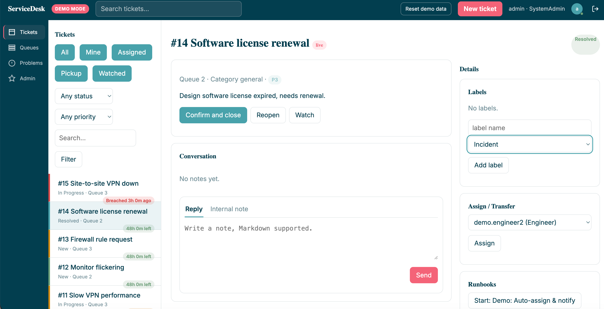

# ServiceDesk

A lightweight, self-hostable ITSM ticketing system: multi-tenant customer support, queue-based ticket routing, Markdown notes, labels, full-text search, real-time updates, a lightweight workflow engine with an interactive **Runbook Hook** for incident response, webhooks, and Prometheus metrics — shipped as a single Go binary + static HTML/HTMX frontend.



See [DESIGN.md](DESIGN.md) for the full design, [ARCHITECTURE.md](ARCHITECTURE.md) for how the code is organized, and [RELEASE.md](RELEASE.md) for what's shipped so far.

## Quickstart

### Option 1 — go run (SQLite, zero setup)

```bash
go run ./cmd/servicedesk
```

Visit `http://localhost:8080`. On first run, if `SERVICEDESK_STATIC_USERS` isn't set, a default `admin` / `admin123` account is created (the log will warn you to change it). Data is stored in `./servicedesk.db`.

### Option 2 — Demo mode (seeded data, zero setup)

```bash
make demo
# or: DEMO_MODE=true go run ./cmd/servicedesk
```

Seeds 3 orgs, 2 queues, engineers/customers, ~15 tickets, a Problem, and a Runbook on first boot (skipped if the DB already has data — safe to restart). Logins: `demo.admin`/`demo1234` (QueueAdmin), `demo.engineer1..4`/`demo1234`, `demo.customer1..6`/`demo1234`. A "DEMO MODE" badge appears in the top bar, with a "Reset demo data" button for SystemAdmins. See [RELEASE/v_1.0.8.md](RELEASE/v_1.0.8.md).

### Option 3 — Docker Compose

```bash
make up          # sqlite, foreground   (docker-compose.yaml)
make up-mysql     # MySQL-backed         (docker-compose-mysql.yml)
make up-postgres  # PostgreSQL-backed    (docker-compose-postgresql.yml)
```

Run `make` with no arguments to see every available target.

### Option 4 — Kubernetes

```bash
cp k8s/11-secret.example.yaml k8s/11-secret.yaml            # fill in real values
cp k8s/21-postgres-secret.example.yaml k8s/postgres-secret.yaml
kubectl apply -f k8s/
```

Defaults to PostgreSQL (see [DESIGN/06_design_technical_architecture.md](DESIGN/06_design_technical_architecture.md) §6.4 for why SQLite doesn't belong in a multi-replica deployment).

## Logging in

- **Internal staff** (Engineer / QueueAdmin / SystemAdmin): leave the "Organization" field blank.
- **Customers**: multi-tenant — supply the organization name your account belongs to, alongside username/password. An admin assigns customers to organizations under `/admin/orgs`.

## Configuration

Configure via environment variables or a YAML file (env vars always win — see [config.example.yaml](config.example.yaml)):

```bash
go run ./cmd/servicedesk -config config.yaml
# or
SERVICEDESK_CONFIG_FILE=config.yaml go run ./cmd/servicedesk
```

| Variable | Default | Notes |
| :--- | :--- | :--- |
| `SERVICEDESK_ADDR` | `:8080` | Listen address. |
| `SERVICEDESK_DB_DRIVER` | `sqlite` | `sqlite` \| `mysql` \| `postgres`. |
| `SERVICEDESK_DB_DSN` | `file:servicedesk.db?...` | Driver-specific DSN. |
| `SERVICEDESK_JWT_SECRET` | dev placeholder | **Change this in production.** |
| `SERVICEDESK_STATIC_USERS` | *(empty)* | Demo accounts: `user:pass:Role,user2:pass2:Role2`. |
| `SERVICEDESK_LOG_LEVEL` | `info` | `fatal` \| `error` \| `warning` \| `info` \| `debug`. |
| `SERVICEDESK_SMTP_*` | *(empty)* | SMTP host/port/from/user/pass for email notifications; unset = logs instead of sending. |
| `SERVICEDESK_WORKER_POOL_SIZE` / `_POLL_MS` | `4` / `500` | Background worker pool (webhooks + workflow engine). |
| `DEMO_MODE` (or `-demo`) | `false` | Seed demo orgs/queues/users/tickets on boot if the DB is empty. See [RELEASE/v_1.0.8.md](RELEASE/v_1.0.8.md). |
| `DEMO_RESET` (or `-demo-reset`) | `false` | With `DEMO_MODE`: wipe + reseed demo data on *every* boot, not just when empty. |
| `SEED_DEMO_ONLY` (or `-seed-demo`) | `false` | Seed demo data against the configured DB and exit immediately, without starting the server. |

## Development

```bash
make test          # go test ./...
make vet            # go vet ./...
make fmt             # gofmt
make build           # binary in ./bin
```

The test suite (`internal/httpapi/integration_test.go`) drives the real HTTP server against an in-memory SQLite DB with a cookie-jar client — it's the same shape of test you'd write by hand with `curl`, just automated.

## Feature highlights

- Ticket lifecycle with an explicit, enforced state machine (New → In Progress → Resolved → Closed, with Reject and Reopen rules).
- Multi-tenant Customer support: org-scoped login, ticket visibility, and sharing via watch.
- Queue-based routing: Engineers pick up from queues they belong to; QueueAdmins assign/transfer across any queue.
- Markdown notes (internal/external) with syntax-highlighted code blocks.
- Full-text search across tickets and notes (dialect-appropriate: SQLite FTS5 / MySQL FULLTEXT / Postgres tsvector).
- Real-time updates via Server-Sent Events.
- A workflow engine with a **Runbook Hook**: pause for user input, call an external API, render a templated note — see [DESIGN/04_design_runbook_hook.md](DESIGN/04_design_runbook_hook.md).
- Signed outbound webhooks with retry/backoff.
- Prometheus metrics at `/metrics`, structured logs, `/health` readiness endpoint.

## Security scanning

`.github/workflows/security.yml` runs on every push/PR to `main` and weekly on a schedule:

- **Semgrep** (`p/golang`, `p/sql-injection`, `p/secrets`, `p/owasp-top-ten`) — SAST.
- **Trivy** — filesystem scan (Go module CVEs) and a container image scan of the built Dockerfile. Both fail the build on CRITICAL/HIGH findings; results also upload as SARIF to the repo's Security tab.

## Releasing

```bash
make release VERSION=1.1.0   # bumps VERSION, commits, tags v1.1.0, pushes
```

Pushing a `v*` tag triggers `.github/workflows/release.yml`: tests gate the build, then a cross-platform binary matrix (linux/darwin/windows, amd64/arm64) is built and attached to a GitHub Release. `ci.yml` separately builds and pushes the Docker image to GHCR on the same tag push.

## License

[Apache 2.0](LICENSE).
